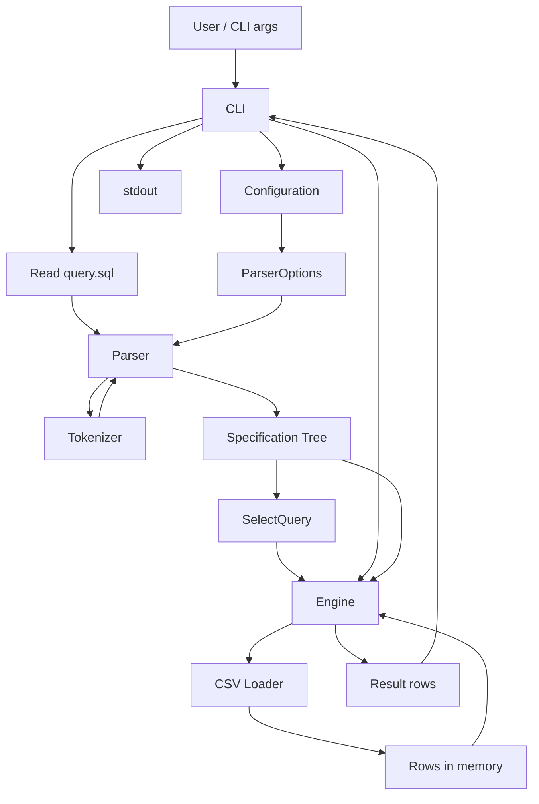

# ARCHITECTURE.md — Micro-SQL Engine

## 1. Мета системи

Micro-SQL Engine — консольна утиліта для виконання спрощених SQL-подібних запитів до CSV-файлів.

Поточна версія підтримує:

- `SELECT <columns>`;
- `FROM <csv-file>`;
- `WHERE <conditions>`;
- складні логічні фільтри з `AND`, `OR`, `NOT` і дужками;
- `ORDER BY <column> [ASC|DESC]`;
- зовнішню JSON-конфігурацію для параметрів фільтрації.

## 2. Компоненти системи

1. **CLI (`cli.py`)**
   - читає аргументи командного рядка;
   - читає SQL-файл;
   - завантажує конфігурацію;
   - викликає парсер та engine;
   - виводить результат у CSV-форматі.

2. **Configuration (`config.py`)**
   - читає `microsql.config.json`;
   - повертає безпечні значення за замовчуванням, якщо файл відсутній;
   - формує `ParserOptions` для активації параметрів рушія фільтрації.

3. **Parser (`parser.py`)**
   - розбирає `SELECT`, `FROM`, `WHERE`, `ORDER BY`;
   - будує `SelectQuery`;
   - для `WHERE` створює дерево специфікацій.

4. **Tokenizer (`tokenizer.py`)**
   - розбиває `WHERE`-вираз на токени;
   - підтримує `AND`, `OR`, `NOT`, дужки, літерали та оператори порівняння.

5. **Specification Model (`ast_nodes.py`, `specifications.py`)**
   - містить `ISpecification<Row>`;
   - містить конкретні специфікації: `Comparison`, `AndSpecification`, `OrSpecification`, `NotSpecification`, `GreaterThanSpec`, `EqualsSpec`;
   - забезпечує сумісність зі старими назвами `Expr`, `Comparison`, `Logical`.

6. **CSV Loader (`csv_utils.py`)**
   - зчитує CSV у пам'ять;
   - виконує приведення типів: `int`, `float`, `str`, `None`.

7. **Execution Engine (`engine.py`)**
   - перевіряє колонки;
   - застосовує `WHERE` через `is_satisfied_by(row)`;
   - застосовує `ORDER BY`;
   - формує результат `SELECT`.

## 3. Потік даних



## 4. Specification Pattern

Основний контракт:

```python
class ISpecification:
    def is_satisfied_by(self, row): ...
    def And(self, spec): ...
    def Or(self, spec): ...
    def Not(self): ...
```

Приклад дерева для SQL:

```sql
WHERE (age > 20 AND role = 'admin') OR (salary > 5000)
```

Логічна структура:

```text
OrSpecification
├── AndSpecification
│   ├── Comparison(age > 20)
│   └── Comparison(role = 'admin')
└── Comparison(salary > 5000)
```

`engine.py` не залежить від конкретних класів умов. Він працює з абстракцією `ISpecification`.

## 5. Дотримання OCP

Нові можливості фільтрації додаються через нові класи специфікацій. Наприклад, для майбутньої підтримки `LIKE` можна створити `LikeSpecification`, не змінюючи основний цикл виконання запиту в `engine.py`.

## 6. Висновок

Архітектура стала більш розширюваною: парсер відповідає за побудову дерева специфікацій, engine лише застосовує готовий фільтр до рядків CSV, а конфігурація впливає на поведінку рушія під час старту програми.
