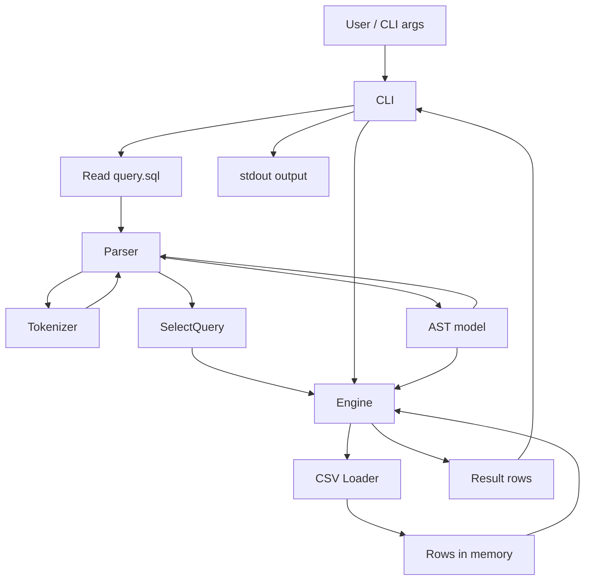

# ARCHITECTURE.md — Micro-SQL Engine

## Відомості про роботу

- **ПІБ студента:** Тарнавський Микита Олегович
- **Назва навчального закладу:** КНУ
- **Назва дисципліни:** Конструювання програмного забезпечення
- **Хто перевірив:** Шабатин П. Є.
- **Тема:** Інфраструктура проекту, Архітектура та Стандарти кодування.
- **Мова реалізації:** Python
- **Дата:** 23.02.2026

---

## 1. Мета системи

Micro-SQL Engine — консольна утиліта для виконання спрощених
SQL-подібних запитів до CSV-файлів.

### Поточні можливості
- `SELECT <columns>`
- `FROM <csv-file>`
- `WHERE <conditions>`
- `ORDER BY <column> [ASC|DESC]`

### Архітектурна мета
Розділити систему на незалежні модулі:
- ввід/CLI
- парсинг запиту
- токенізація WHERE
- модель виразів (Expression Tree)
- завантаження CSV
- виконання запиту

Це спрощує:
- тестування;
- підтримку;
- розширення (`GROUP BY`, агрегати, Hash Aggregation).

---

## 2. Діаграма компонентів (Component Diagram)

### 2.1. Високорівневий поділ системи на модулі

Система складається з таких модулів:

1. **CLI (`cli.py`)**
   - читає аргументи командного рядка;
   - читає SQL-файл;
   - викликає парсер та engine;
   - виводить результат у CSV-форматі.

2. **Parser (`parser.py`)**
   - розбирає `SELECT`, `FROM`, `WHERE`, `ORDER BY`;
   - формує об’єкт запиту `SelectQuery`;
   - для `WHERE` використовує токенізатор і AST.

3. **Tokenizer (`tokenizer.py`)**
   - розбиває `WHERE`-вираз на токени:
     ідентифікатори, літерали, оператори, дужки, `AND`, `OR`.

4. **AST / Expression Model (`ast_nodes.py`)**
   - описує дерево виразів (`Comparison`, `Logical`, тощо);
   - обчислює `WHERE`-умови для кожного рядка даних.

5. **CSV Loader (`csv_utils.py`)**
   - зчитує CSV у пам’ять;
   - виконує динамічне приведення типів
     (`int`, `float`, `str`, `None`).

6. **Execution Engine (`engine.py`)**
   - перевіряє колонки;
   - застосовує `WHERE`;
   - застосовує `ORDER BY`;
   - формує результат `SELECT`.

---

### 2.2. Напрямок потоку даних між модулями



### 2.3. Пояснення потоку даних

- `CLI` передає текст запиту в `Parser`.
- `Parser` використовує `Tokenizer` для `WHERE`.
- `Parser` будує `SelectQuery` та AST (дерево виразів).
- `Engine` отримує `SelectQuery` і завантажує дані через `CSV Loader`.
- `Engine` обробляє рядки та повертає результат у `CLI`.
- `CLI` друкує результат у консоль.

---

## 3. Опис інтерфейсів / методів / шляхів взаємодії

> Для Python (скриптово-модульний підхід) замість UML Class Diagram
> наведено опис основних модулів, функцій, вхідних/вихідних параметрів
> та шляхів взаємодії між компонентами.

---

### 3.1. Модуль `cli.py` (точка входу)

#### `build_parser() -> argparse.ArgumentParser`
**Призначення:**  
Створює CLI-інтерфейс програми.

**Вхід:**
- немає

**Вихід:**
- `ArgumentParser` з параметрами:
  - `query_file` — шлях до `.sql` файлу
  - `--data-dir` — папка з CSV-файлами

**Взаємодія:**
- використовується функцією `main()`.

---

#### `main() -> None`
**Призначення:**  
Головний сценарій виконання програми.

**Вхід:**
- аргументи командного рядка

**Вихід:**
- друк результату в `stdout`

**Шлях взаємодії:**
1. читає `query.sql`;
2. викликає `parse_query(sql_text)`;
3. викликає `execute_query(query, data_dir)`;
4. виводить результат через `_print_as_csv(...)`.

---

#### `_print_as_csv(rows: list[dict[str, object]]) -> None`
**Призначення:**  
Виводить результуючі рядки у форматі CSV.

**Вхід:**
- `rows` — список рядків результату

**Вихід:**
- текст у `stdout`

---

### 3.2. Модуль `parser.py` (розбір SQL-запиту)

#### `parse_query(sql_text: str) -> SelectQuery`
**Призначення:**  
Розбирає SQL-подібний запит та формує `SelectQuery`.

**Вхід:**
- `sql_text: str` — текст SQL-запиту

**Вихід:**
- `SelectQuery`, що містить:
  - `columns: list[str]`
  - `source: str`
  - `where: Expr | None`
  - `order_by: OrderBy | None`

**Взаємодія:**
- використовує `tokenize_where(...)` з `tokenizer.py`;
- будує AST для `WHERE` через внутрішній `_WhereParser`;
- передає `SelectQuery` в `engine.py`.

---

#### Клас `_WhereParser`
**Призначення:**  
Рекурсивний парсер для `WHERE`-виразів.

**Основні методи:**
- `parse() -> Expr`
- `_parse_or() -> Expr`
- `_parse_and() -> Expr`
- `_parse_comparison_or_group() -> Expr`
- `_parse_operand() -> Operand`

**Вхід:**
- `tokens: list[Token]`

**Вихід:**
- корінь AST (`Expr`)

**Примітка:**
Методи реалізують пріоритет операторів:
- `AND` має вищий пріоритет, ніж `OR`.

---

### 3.3. Модуль `tokenizer.py` (токенізація WHERE)

#### `tokenize_where(expression: str) -> list[Token]`
**Призначення:**  
Перетворює текст `WHERE` на список токенів.

**Вхід:**
- `expression: str`

**Вихід:**
- `list[Token]`

**Підтримувані токени:**
- `IDENT`
- `NUMBER`
- `STRING`
- `COMPOP` (`=`, `!=`, `<>`, `<`, `>`, `<=`, `>=`)
- `AND`, `OR`
- `LPAREN`, `RPAREN`

**Взаємодія:**
- повертає токени для `parser.py`.

---

### 3.4. Модуль `ast_nodes.py` (дерево виразів / AST)

#### Основні структури
- `SelectQuery`
- `OrderBy`
- `Expr` (базовий клас)
- `Comparison(Expr)`
- `Logical(Expr)`
- `Identifier`
- `Literal`

---

#### `Comparison.evaluate(row: dict[str, Any]) -> bool`
**Призначення:**  
Обчислює порівняння для одного рядка.

**Приклади:**
- `salary > 2000`
- `role = 'user'`

**Вхід:**
- `row: dict[str, Any]`

**Вихід:**
- `bool`

---

#### `Logical.evaluate(row: dict[str, Any]) -> bool`
**Призначення:**  
Обчислює `AND` / `OR` між двома підвиразами.

**Вхід:**
- `row: dict[str, Any]`

**Вихід:**
- `bool`

---

### 3.5. Модуль `csv_utils.py` (CSV + типізація)

#### `load_csv_rows(csv_path: Path) -> list[dict[str, Any]]`
**Призначення:**  
Завантажує CSV у пам’ять у вигляді списку словників.

**Вхід:**
- `csv_path: Path`

**Вихід:**
- `list[dict[str, Any]]`

**Приклад одного рядка:**
```python
{"id": 2, "name": "Jane Smith", "role": "user", "salary": 3000}
```

---

#### `infer_scalar(value: str | None) -> Any`
**Призначення:**  
Визначає тип значення CSV.

**Вхід:**
- `value: str | None`

**Вихід:**
- `int`, `float`, `str`, або `None`

**Правила:**
- порожній рядок -> `None`
- ціле число -> `int`
- число з крапкою -> `float`
- інакше -> `str`

---

### 3.6. Модуль `engine.py` (виконання запиту)

#### `execute_query(query: SelectQuery, data_dir: Path) -> list[dict[str, Any]]`
**Призначення:**  
Виконує SQL-подібний запит над CSV-даними.

**Вхід:**
- `query: SelectQuery`
- `data_dir: Path`

**Вихід:**
- `list[dict[str, Any]]` (результат запиту)

**Алгоритм (без деталей реалізації):**
1. завантажити CSV;
2. перевірити колонки;
3. відфільтрувати рядки за `WHERE`;
4. відсортувати за `ORDER BY`;
5. залишити колонки з `SELECT`.

---

#### `_validate_columns_exist(...) -> None`
**Призначення:**  
Перевіряє наявність потрібних колонок у CSV.

---

#### `_sort_key(value: Any) -> tuple[int, Any]`
**Призначення:**  
Формує ключ сортування з підтримкою `None`.

---

## 4. Опис структур даних (стан системи в пам'яті)

У цьому розділі описано структури даних, що використовуються
для зберігання стану системи в пам’яті, та обґрунтовано їх вибір.

---

### 4.1. `list[dict[str, Any]]` — табличні дані CSV у пам’яті

**Типи структур:**
- `list` (послідовність рядків)
- `dict` (HashMap для значень колонок)

**Де використовується:**
- `csv_utils.py`
- `engine.py`

**Приклад:**
```python
[
    {"id": 1, "name": "John Doe", "role": "admin", "salary": 5000},
    {"id": 2, "name": "Jane Smith", "role": "user", "salary": 3000}
]
```

**Обґрунтування вибору:**
- `list` зберігає порядок рядків CSV;
- `dict` дає швидкий доступ до значення за назвою колонки;
- проста та наочна модель для навчального проєкту;
- зручно для фільтрації, сортування, проєкції.

---

### 4.2. Expression Tree (Tree) для `WHERE`-умов

**Тип структури:**
- `Tree` (дерево виразів)

**Де використовується:**
- `parser.py`
- `ast_nodes.py`

**Приклад виразу:**
```sql
salary > 2000 AND role = 'user'
```

**Логічна структура дерева:**
- `Logical(AND)`
  - `Comparison(salary > 2000)`
  - `Comparison(role = 'user')`

**Обґрунтування вибору:**
- природно представляє вкладені логічні умови;
- підтримує дужки та пріоритет операторів;
- легко розширюється новими операторами;
- відокремлює парсинг від виконання.

---

### 4.3. `list[Token]` — проміжне представлення для парсера

**Тип структури:**
- `list` (послідовність токенів)

**Де використовується:**
- `tokenizer.py`
- `parser.py`

**Приклад елемента:**
```python
Token(kind="IDENT", value="salary")
```

**Обґрунтування вибору:**
- зручно для рекурсивного спуску;
- легко керувати поточною позицією в потоці токенів;
- спрощує налагодження парсера.

---

### 4.4. `SelectQuery` / `OrderBy` (dataclass) — модель запиту

**Тип структури:**
- структурований об’єкт (dataclass)

**Де використовується:**
- `parser.py`
- `engine.py`

**Призначення:**
- передати результат парсингу в `engine.py`
  через чіткий контракт.

**Обґрунтування вибору:**
- покращує читабельність;
- зменшує кількість помилок при передачі даних між модулями;
- зручно розширювати новими полями (`group_by`, `limit`).

---

### 4.5. Сортування: `sorted(...)` + ключ сортування

**Типи структур / алгоритмів:**
- вбудований алгоритм Python `Timsort`
- ключ сортування (`tuple[int, Any]`)

**Де використовується:**
- `engine.py`

**Обґрунтування вибору:**
- стабільне та ефективне сортування;
- не потрібна ручна реалізація алгоритму;
- `tuple`-ключ дозволяє коректно обробляти `None`.

---

### 4.6. Планована структура для `GROUP BY` (HashMap / Hash Aggregation)

> Поточна версія ще не реалізує `GROUP BY`,
> але архітектура це передбачає.

**Тип структури:**
- `HashMap` (у Python — `dict`)

**Запланований формат:**
```python
{
    ("user",): {"count": 10, "sum_salary": 32000},
    ("admin",): {"count": 2, "sum_salary": 12000}
}
```

**Обґрунтування вибору:**
- швидкий доступ до стану групи;
- природна реалізація для `GROUP BY`;
- зручно накопичувати агрегати (`COUNT`, `SUM`, `AVG`).

---

### 4.7. Чому не використовуються `Graph` та `PriorityQueue`

**Graph (граф):**
- не потрібен, бо система не моделює мережу зв’язків;
- запит виконується над рядками таблиці.

**PriorityQueue (черга з пріоритетом):**
- не потрібна на поточному етапі,
  оскільки сортування виконується через `sorted(...)`;
- може знадобитися пізніше для `TOP K`
  або потокової обробки.

---

## 5. Шляхи взаємодії компонентів (без деталей реалізації)

### Сценарій виконання запиту
1. Користувач запускає програму з параметрами CLI.
2. `cli.py` читає файл `query.sql`.
3. `parser.py` аналізує SQL-текст.
4. `tokenizer.py` токенізує частину `WHERE`.
5. `parser.py` будує AST (дерево виразів).
6. `parser.py` формує `SelectQuery`.
7. `engine.py` завантажує CSV через `csv_utils.py`.
8. `engine.py` обчислює `WHERE` для кожного рядка через AST.
9. `engine.py` сортує та формує результат `SELECT`.
10. `cli.py` виводить результат у CSV-форматі.

---

## 6. Висновок

Архітектура Micro-SQL Engine відповідає вимогам етапу
проектування архітектури та містить:

- **діаграму компонентів** з напрямком потоку даних;
- **опис інтерфейсів/методів** (для Python-модулів);
- **опис структур даних** у пам’яті з обґрунтуванням вибору.

Поточна модульна побудова спрощує розвиток системи:
`GROUP BY`, агрегати та Hash Aggregation.
